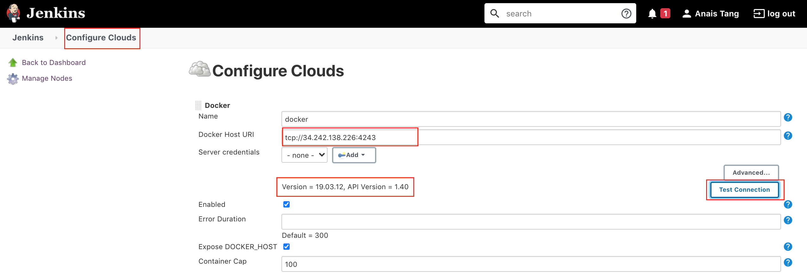
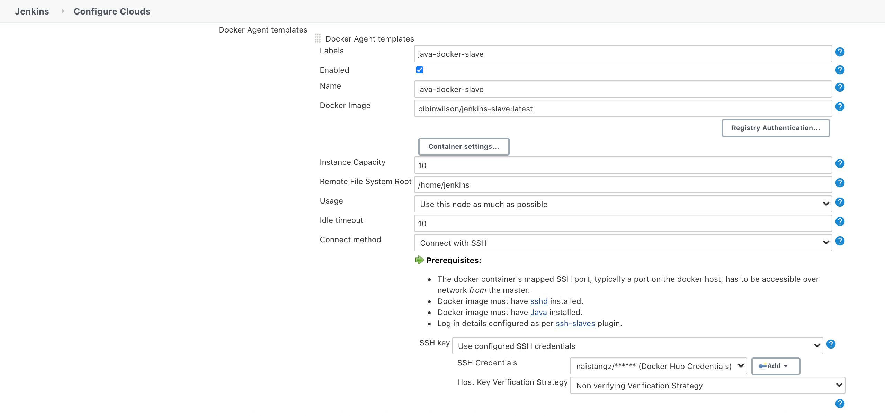
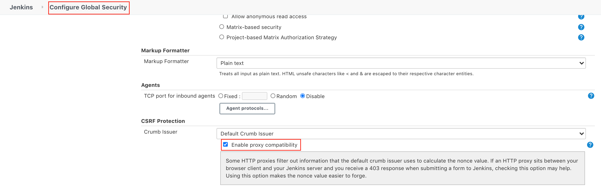

# Automating Docker container deployment with Jenkins :whale: 

## TL;DR
**WHAT**: Use Docker Plugin to connect Jenkins to Docker and run entire pipelines inside containers

**HOW**: Install Jenkins, create a Docker host to access containers through an API, slave build agent images, installing and configuring Docker plugins

---

**Contents**
1. [Part I: Installing Java8 and Jenkins](#part-i-installing-java8-and-jenkins)
2. [Part II: Setting up a server on AWS EC2 to Install Docker](#part-ii-enable-docker-remote-api-on-docker-host)
3. [Part III: Configuring Jenkins and managing Docker plugins](#part-iii-configuring-jenkins)
4. [Part IV Test Docker Slaves Using FreeStyle Job](#part-iv-creating-a-jenkins-slave-docker-image)

---
## Part I Installing Java8 and Jenkins

> Full installation instructions [here](https://www.macminivault.com/installing-jenkins-on-macos/)

1. Install Jenkins on MacOS using Homebrew package manager :beers: If homebrew already installed (run in Termainl `brew -v` to check), skip to the next step 
```bash
/usr/bin/ruby -e /usr/bin/ruby -e "$(curl -fsSL https://raw.githubusercontent.com/Homebrew/install/master/install)"
```

2. Check if Homebrew requires any recommendations:
```bash
brew doctor
```

3. Before installing Jenkins, we need to install Java8
```bash
brew cask install java8
```
**Troubleshooting error**:
```bash
Cask 'java8' is unavailable: No Cask with this name exists.
java --version
java 14.0.1 2020-04-14
Java(TM) SE Runtime Environment (build 14.0.1+7)
Java HotSpot(TM) 64-Bit Server VM (build 14.0.1+7, mixed mode, sharing)
``` 

Jenkins requires Java8. Click [here](http://www.oracle.com/technetwork/java/javase/downloads/jdk8-downloads-2133151.html) to install.

Check all installed java version
```bash
/usr/libexec/java_home -V
```
**which returns**
```bash
Matching Java Virtual Machines (2):
    14.0.1, x86_64:	"Java SE 14.0.1"	/Library/Java/JavaVirtualMachines/jdk-14.0.1.jdk/Contents/Home
    1.8.0_251, x86_64:	"Java SE 8"	/Library/Java/JavaVirtualMachines/jdk1.8.0_251.jdk/Contents/Home
```

Pick `1.8.0_251, x86_64` to set as the default then:
```bash
export JAVA_HOME=`/usr/libexec/java_home -v 1.8.0_251, x86_64`
```

When you run java -version you will see:
```bash
java version "1.8.0_251"
```

4. To make the Jenkins web interface accessible from anywhere, not just local machine, open up the config file:
```bash
sudo nano /usr/local/opt/jenkins-lts/homebrew.mxcl.jenkins-lts.plist
```

5. Find this line:
```bash
<string>--httpListenAddress=127.0.0.1</string>
```

6. Change it to:
```bash
<string>--httpListenAddress=0.0.0.0</string>
```
To exit out of nano, press `Ctrl+X`, hit `Y` to save Changes, hit `Enter`

7. Start or restart Jenkins
```bash
brew services start jenkins-lts
brew services restart jenkins-lts
```

8. Open the browser and type in the following:
```bash
http://localhost:8080/
```

---
# Part II Enable docker remote API on docker host
1. Set up Jenkins server on AWS and SSH into the AWS server 
2. Follow tutorial to install Docker on a AWS EC2 Linux Server
https://www.digitalocean.com/community/tutorials/how-to-install-and-use-docker-on-ubuntu-18-04
3. Enable Docker Remote API
https://scriptcrunch.com/enable-docker-remote-api/
To test using a REST client
```bash
curl http://localhost:4243/version
```
```bash
http://AWS_JENKINS_SERVER_PUBLIC_IP:4243/images/json
```
---
# Part IV Creating a Jenkins Slave Docker Image
1. In our Ubuntu Instance, make sure you are running with `root` privileges (sudo) type in the following command:

```bash
sudo su
```
**Then**
```bash
docker pull bibinwilson/jenkins-slave
```
2. Refresh page on browser to check that the image has been created successfully
```bash
http://AWS_JENKINS_SERVER_PUBLIC_IP:4243/images/json
http://34.242.138.226:4243/images/json
http://localhost:4243/images/json
```

```json
[{
"Containers":-1,
"Created":1585916206,
"Id":"sha256:d935e085182c40d82f58e7af1b9369822f29138592d5d0decab32f0bff00c94a",
"Labels":{"maintainer":"Bibin Wilson <bibinwilsonn@gmail.com>"},
"ParentId":"",
"RepoDigests":["bibinwilson/jenkins-slave@sha256:2360b4a2bced494fd8affa94c174057208d540783aeba4261cce74a6ea376342"],
"RepoTags":["bibinwilson/jenkins-slave:latest"],
"SharedSize":-1,
"Size":632232399,
"VirtualSize":632232399
}]
```

## Part III Configuring Jenkins
1. Navigate to Manage Jenkins > Manage Plugins > Available > Install **all** Docker plugins, `docker-build-step`, `Docker Compose Build Step`, `Docker build plugins` 
2. Once plugins have been installed, navigate to Manage Jenkins > Manage Nodes and Clouds
3. Click on Configure Clouds > Add a new Cloud :cloud:
4. Click Docker
5. In Docker Host URI, enter the public IP address of the Docker Host on port `4243`



**Note**: if a 403 error is returned, go to Manage Jenkins > Security > Configure Global Security > **CSRF Protection** > Enable Proxy Compatibility


---

## Part IV Test Docker Slaves Using FreeStyle Job
1. Now that you have slave configurations ready, create a freestyle job on jenkins